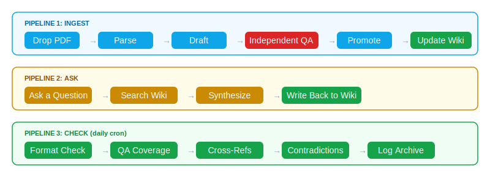

# open-llm-wiki

**自己会生长的 AI 知识库。扔论文进去，活的知识出来�?*

> 每读一篇论文，下一个问题就更快。每问一个问题，wiki 就更聪明。知识在复利——不只是累积�?

灵感来自 [Karpathy �?LLM Wiki 概念](https://gist.github.com/karpathy/442a6bf555914893e9891c11519de94f)�?3 篇论文实战验证。零手写。每条事实独立审查�?

---

## 一个数字说明一�?

我们写了 23 篇论文摘要。AI 自检说全部正确。独�?QA �?**16 篇有错误�?*

这就是为什�?QA 必须独立。永远�?

```
自检通过�?  100%  �?"看起来没问题！✅"
独立QA通过�?  31%  �?错误数字、张冠李戴、微妙矛�?
```

这不�?bug，是 LLM 的根本特性——它看不到自己的错误�?*其他 AI 知识库工具都跳过了这一步。我们没有�?*

---

## 问题

读了一堆论文，记了一堆笔记，一周后全忘光。笔记不会生长，每篇论文都从零开始�?

## 解法

一�?*复利增长**�?wiki——每篇论文丰富已有的概念，每个问题可以让知识库生长，矛盾被独�?AI 审查员自动捕获�?

---

## 长什么样

**一个概念页�?8 篇论文喂进来之后**——持续演化的理解，不是静态摘要：

```markdown
# MoE (Mixture of Experts)

> 细粒度专家分�?+ 负载均衡。DeepSeek 的标志性架构�?

## 创新时间�?
| 时间    | 模型              | 关键结果                       |
|--------|-------------------|-------------------------------|
| 2024.01 | DeepSeekMoE      | top-6/64 experts, 2.8B 活跃   |
| 2024.06 | Coder-V2         | 236B/21B, 代码专用 MoE        |
| 2024.12 | V3               | 671B/37B, aux-loss-free �?    |
| 2026.04 | V4               | 1.6T/49B, 百万 token 上下�?★★|

## 核心洞察
MoE �?实验�?�?生产架构"用了 4 代�?
突破�?V3 �?auxiliary-loss-free 路由——不再交均衡税�?
```

**我们抓到的一个反模式**（真实案例）�?

> DeepSeek-V3.2 �?Figure 1 有未标注的性能柱。我们猜了每个柱对应哪个 benchmark�?*5 个里猜错�?4 个�?* 独立 QA 抓住了。表格有标签，图有艺术加工。永远以 Table 为准�?

---

## 快速开�?

```bash
curl -sSL https://raw.githubusercontent.com/AIwork4me/open-llm-wiki/main/setup.sh | bash
cp ~/papers/attention.pdf my-llm-wiki/raw/
# 告诉你的 agent: "Ingest this paper: my-llm-wiki/raw/attention.pdf"
```

�?[Obsidian](https://obsidian.md) 打开 `my-llm-wiki/`——Graph View、反向链接、标签全部开箱即用�?

**前提**：能 spawn 子代理的 AI agent（推�?[OpenClaw](https://github.com/openclaw/openclaw) + glm-5.1）。完整指南：[QUICKSTART.md](QUICKSTART.md)�?

---

## 工作原理



三条流水线：

| 流水�?| 触发 | 做什�?|
|--------|------|--------|
| **Ingest** | �?PDF | 解析 �?起草 �?**独立 QA** �?晋升 �?更新概念 �?矛盾检�?|
| **Ask** | 问问�?| 搜索 wiki �?综合 �?**答案写回** wiki |
| **Check** | 每日定时 | 格式检查、QA 覆盖、交叉引用、日志归�?|

---

## 包含什�?

```
open-llm-wiki/
├── setup.sh                  �?一键安�?
├── SCHEMA.md                 �?Wiki 数据结构
├── skills/
�?  ├── wiki-ingest/          �?论文 �?wiki 流水线（10 步）
�?  ├── query-writeback/      �?问题 �?wiki 生长�? 步）
�?  └── wiki-lint/            �?健康检查（5 维度�?
├── templates/                �?页面模板
├── examples/
�?  ├── deepseek-v4-sample.md �?真实 source 页示�?
�?  └── minimal-vault/        �?可运行的最�?wiki
└── assets/                   �?图表
```

---

## 实战验证

23 �?DeepSeek 论文�?024.01 �?2026.01），覆盖架构演化、推理突破、多模态、专业化方向�?

| 指标 | 数�?|
|------|------|
| 入库论文 | 23 |
| Source �?| 23 |
| Concept �?| 11 |
| 首次 QA 通过�?| 31% �?70%�?硬数字优�?规则后） |
| 抓住的关键错�?| 1 次（V3.2 Figure vs Table�?|
| 子代理可靠�?| 4/4 = 100% |

详见 [SHOWCASE.md](SHOWCASE.md) 的完整产出，以及 [EXAMPLES.md](EXAMPLES.md) 里的每一个错误�?

---

## 设计原则

1. **论文是原料，概念才是 wiki** �?一篇论文入库应该更�?3-5 个概念页
2. **大模型不能自�?* �?QA 和矛盾检测必须用独立子代�?
3. **查询�?wiki 生长** �?好的综合分析写回 wiki，不消失在聊天里
4. **矛盾标记，永不覆�?* �?`⚠️ [CONTRADICTION]` 保留双方
5. **硬数字是脊梁** �?"有竞争力的结�?是废话，精确 benchmark 才是知识

---

## 致谢

- **[Andrej Karpathy](https://twitter.com/karpathy)** �?[LLM Wiki 概念](https://gist.github.com/karpathy/442a6bf555914893e9891c11519de94f)的原创�?
- **[OpenClaw](https://github.com/openclaw/openclaw)** �?让独�?QA 成为可能�?agent 平台
- **DeepSeek** �?23 篇论文作为测试套�?

## 为什么不用现有工具？

| | 手动笔记 | Zotero | Readwise | **open-llm-wiki** |
|---|:-:|:-:|:-:|:-:|
| 自动入库论文 | ❌ | ❌ | ❌ | ✅ |
| 独立 AI 质检 | ❌ | ❌ | ❌ | ✅ |
| 矛盾检测 | ❌ | ❌ | ❌ | ✅ |
| 概念跨论文积累 | ❌ | ❌ | 部分 | ✅ |
| 查询写回（问题让 wiki 生长） | ❌ | ❌ | ❌ | ✅ |
| Obsidian 原生（Graph View、反向链接） | ❌ | ✅ | ✅ | ✅ |
| 无需 API Key | ✅ | ✅ | ❌ | ✅ |

## Star History

[](https://star-history.com/#AIwork4me/open-llm-wiki&Date)

## 许可

MIT
